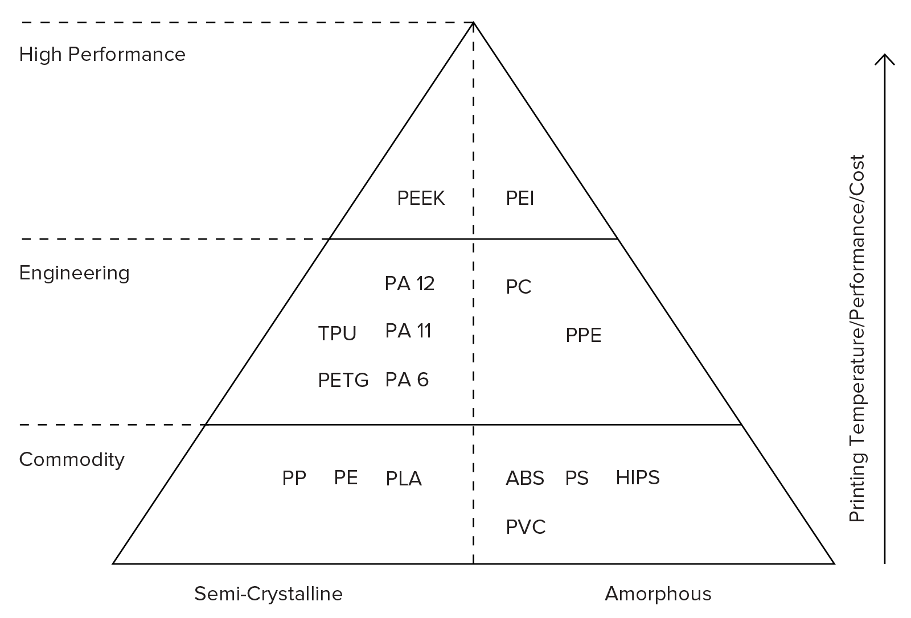

# Fused Depositon Modelling (FDM)
## or Fused Filament Fabrication (FFF)
### Thermoplastic material is ejected from a heated nozzle and buils the part by layers
### Additave manufactoring process 
- Pros: Cost effective, wide range of thermoplastic materials available
- Cons: Warping, Printed layers are visible (Low resolution), parts are anisotropic
### How to operate:
1- Load a spool of thermoplastic filament into the printer, the filament is fed into the nozel until the nozzel reaches the desired temperature.    
    
2- The extrusion head, attached to a 3-axis system, moves to the predetermined location and extrudes thin strands layer by layer. Sometimes the material requres to be cooled by cooling fans attached to the extrusion head.
### Usage: 
Usage varies and depends on the material.
### Notes:
### Materials: 