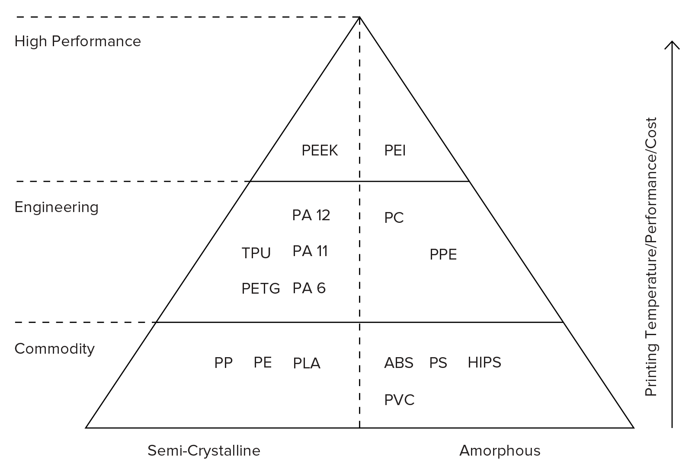

# Fused Depositon Modelling (FDM)
## or Fused Filament Fabrication (FFF)
### Thermoplastic material is ejected from a heated nozzle and buils the part by layers
### Additave manufactoring process
- Pros: Cost effective, wide range of thermoplastic materials available less post processing    
- Cons: Warping, Printed layers are visible (Low resolution), parts are anisotropic    

### How to operate:    
1- Design the part using CAD software.    
2- Load a spool of thermoplastic filament into the printer, the filament is fed into the nozel until the nozzel reaches the desired temperature.    
3- The extrusion head, attached to a 3-axis system, moves to the predetermined location and extrudes thin strands layer by layer. Sometimes the material requres to be cooled by cooling fans attached to the extrusion head.    

### Usage:
Usage varies and depends on the material.    

### Notes:    
    
    

### Materials: 